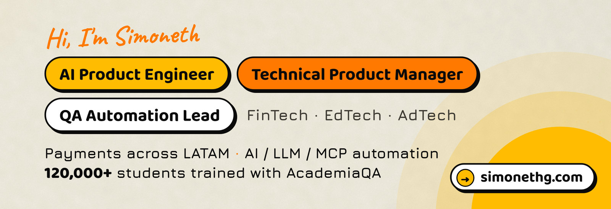
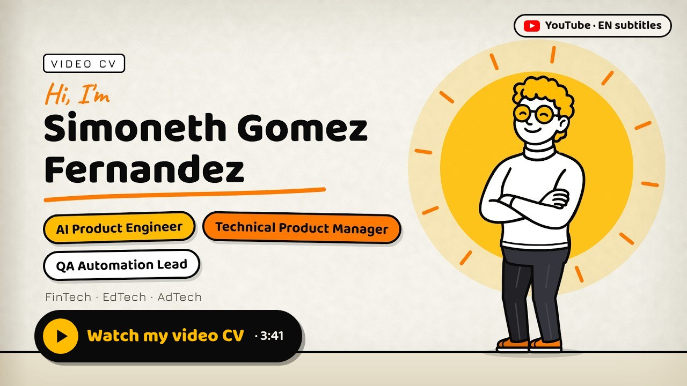

  

<h3 align="center">🎬 My video CV (3:41, English subtitles)</h3>

<!-- VIDEO_CV_ATTACHMENT
  To make the video play right here on GitHub: open this README in the GitHub web editor (or any issue),
  drag in video-cv-github.mp4 (8.6 MB, H.264/AAC 720p), wait for the upload, then paste the generated
  https://github.com/user-attachments/assets/... URL on its own line just below this comment, with a blank
  line before and after it. Keep the YouTube cover below as a fallback for viewers whose app can't play it.
-->

  
   
  ▶ Click the cover to watch on YouTube.

  
  
  
  
  
  
  

---

### 👋 About

**AI Product Engineer · Technical Product Manager · QA Automation Lead** · FinTech · EdTech · AdTech · 📍 Argentina, working remotely

I find where payments and data break, and why, **before your users do**. Now I automate that work with AI.

- 💳 **Payments across LATAM.** 14+ years in software quality, building and testing digital financial products since 2014: cards, transfers, PIX, SPEI, stablecoins, core banking, reconciliation and reporting.
- 🤖 **AI, LLM & MCP automation.** I automate testing and processes with AI agents: LLM/MCP agents that cross-check payment-processor data, dashboards and financial reports, end-to-end payment flows.
- 🎓 **Co-founder of [AcademiaQA](https://academiaqa.com)**, a Spanish-language QA academy: **120,000+ students since 2021**, in 80+ countries.
- 🏆 **Hackathon winner as technical PM**: owning the architecture and the business model, and driving execution with the team all the way to the final demo.
- 🎤 **Speaker at Nerdearla** (2021, 2022).

🎓 Master's in Education (2024) · ✅ Scrum Foundation Professional Certificate (SFPC, 2022) · 🧭 Ontological coach (2022) · 🎤 Nerdearla speaker

---

### 🛠️ Tech I work with

**🧪 Testing & QA**

![Playwright](https://img.shields.io/badge/Playwright-0A0A0A?style=flat-square&logo=data:image/svg+xml;base64,PHN2ZyBmaWxsPSIjRkZCQzAwIiByb2xlPSJpbWciIHZpZXdCb3g9IjAgMCAyNCAyNCIgeG1sbnM9Imh0dHA6Ly93d3cudzMub3JnLzIwMDAvc3ZnIj48dGl0bGU%2BUGxheXdyaWdodDwvdGl0bGU%2BPHBhdGggZD0iTTIzLjk5NiA3LjQ2MmMtLjA1Ni44MzctLjI1NyAyLjEzNS0uNzE2IDMuODUtLjk5NSAzLjcxNS00LjI3IDEwLjg3NC0xMC40MiA5LjIyNy02LjE1LTEuNjUtNS40MDctOS40ODctNC40MTItMTMuMjAxLjQ2LTEuNzE2LjkzNC0yLjk0IDEuMzA1LTMuNjk0LjQyLS44NTMuODQ2LS4yODkgMS44MTUuNTIzLjY4NC41NzMgMi40MSAxLjc5MSA1LjAxMSAyLjQ4OCAyLjYwMS42OTcgNC43MDYuNTA2IDUuNTgzLjM1MiAxLjI0NS0uMjE5IDEuODk3LS40OTQgMS44MzQuNDU1Wm0tOS44MDcgMy44NjNzLS4xMjctMS44MTktMS43NzMtMi4yODZjLTEuNjQ0LS40NjctMi42MTMgMS4wNC0yLjYxMyAxLjA0Wm00LjA1OCA0LjUzOS03Ljc2OS0yLjE3MnMuNDQ2IDIuMzA2IDMuMzM4IDMuMTUzYzIuODYyLjgzNiA0LjQzLS45OCA0LjQzLS45ODFabTIuNzAxLTIuNTFzLS4xMy0xLjgxOC0xLjc3My0yLjI4NmMtMS42NDQtLjQ2OS0yLjYxMiAxLjAzOC0yLjYxMiAxLjAzOFpNOC41NyAxOC4yM2MtNC43NDkgMS4yNzktNy4yNjEtNC4yMjQtOC4wMjEtNy4wOEMuMTk3IDkuODMxLjA0NCA4LjgzMi4wMDMgOC4xODhjLS4wNDctLjczLjQ1NS0uNTIgMS40MTUtLjM1NC42NzcuMTE4IDIuMy4yNjEgNC4zMDgtLjI4YTExLjI4IDExLjI4IDAgMCAwIDIuNDEtLjk1NmMtLjA1OC4xOTctLjExNC40LS4xNy42MS0uNDMzIDEuNjE4LS44MjcgNC4wNTUtLjYzMiA2LjQyNi0xLjk3Ni43MzItMi4yNjcgMi40MjMtMi4yNjcgMi40MjNsMi41MjQtLjcxNWMuMjI3IDEuMDAyLjYgMS45ODcgMS4xNSAyLjgzOGE1LjkxNCA1LjkxNCAwIDAgMS0uMTcxLjA0OVptLTQuMTg4LTYuMjk4YzEuMjY1LS4zMzMgMS4zNjMtMS42MzEgMS4zNjMtMS42MzFsLTMuMzc0Ljg4OHMuNzQ1IDEuMDc2IDIuMDEuNzQzWiIvPjwvc3ZnPg%3D%3D)        

**🤖 AI & agents**

   ![OpenAI AgentKit](https://img.shields.io/badge/OpenAI%20AgentKit-0A0A0A?style=flat-square&logo=data:image/svg+xml;base64,PHN2ZyBmaWxsPSIjRkZCQzAwIiByb2xlPSJpbWciIHZpZXdCb3g9IjAgMCAyNCAyNCIgeG1sbnM9Imh0dHA6Ly93d3cudzMub3JnLzIwMDAvc3ZnIj48dGl0bGU%2BT3BlbkFJPC90aXRsZT48cGF0aCBkPSJNMjIuMjgxOSA5LjgyMTFhNS45ODQ3IDUuOTg0NyAwIDAgMC0uNTE1Ny00LjkxMDggNi4wNDYyIDYuMDQ2MiAwIDAgMC02LjUwOTgtMi45QTYuMDY1MSA2LjA2NTEgMCAwIDAgNC45ODA3IDQuMTgxOGE1Ljk4NDcgNS45ODQ3IDAgMCAwLTMuOTk3NyAyLjkgNi4wNDYyIDYuMDQ2MiAwIDAgMCAuNzQyNyA3LjA5NjYgNS45OCA1Ljk4IDAgMCAwIC41MTEgNC45MTA3IDYuMDUxIDYuMDUxIDAgMCAwIDYuNTE0NiAyLjkwMDFBNS45ODQ3IDUuOTg0NyAwIDAgMCAxMy4yNTk5IDI0YTYuMDU1NyA2LjA1NTcgMCAwIDAgNS43NzE4LTQuMjA1OCA1Ljk4OTQgNS45ODk0IDAgMCAwIDMuOTk3Ny0yLjkwMDEgNi4wNTU3IDYuMDU1NyAwIDAgMC0uNzQ3NS03LjA3Mjl6bS05LjAyMiAxMi42MDgxYTQuNDc1NSA0LjQ3NTUgMCAwIDEtMi44NzY0LTEuMDQwOGwuMTQxOS0uMDgwNCA0Ljc3ODMtMi43NTgyYS43OTQ4Ljc5NDggMCAwIDAgLjM5MjctLjY4MTN2LTYuNzM2OWwyLjAyIDEuMTY4NmEuMDcxLjA3MSAwIDAgMSAuMDM4LjA1MnY1LjU4MjZhNC41MDQgNC41MDQgMCAwIDEtNC40OTQ1IDQuNDk0NHptLTkuNjYwNy00LjEyNTRhNC40NzA4IDQuNDcwOCAwIDAgMS0uNTM0Ni0zLjAxMzdsLjE0Mi4wODUyIDQuNzgzIDIuNzU4MmEuNzcxMi43NzEyIDAgMCAwIC43ODA2IDBsNS44NDI4LTMuMzY4NXYyLjMzMjRhLjA4MDQuMDgwNCAwIDAgMS0uMDMzMi4wNjE1TDkuNzQgMTkuOTUwMmE0LjQ5OTIgNC40OTkyIDAgMCAxLTYuMTQwOC0xLjY0NjR6TTIuMzQwOCA3Ljg5NTZhNC40ODUgNC40ODUgMCAwIDEgMi4zNjU1LTEuOTcyOFYxMS42YS43NjY0Ljc2NjQgMCAwIDAgLjM4NzkuNjc2NWw1LjgxNDQgMy4zNTQzLTIuMDIwMSAxLjE2ODVhLjA3NTcuMDc1NyAwIDAgMS0uMDcxIDBsLTQuODMwMy0yLjc4NjVBNC41MDQgNC41MDQgMCAwIDEgMi4zNDA4IDcuODcyem0xNi41OTYzIDMuODU1OEwxMy4xMDM4IDguMzY0IDE1LjExOTIgNy4yYS4wNzU3LjA3NTcgMCAwIDEgLjA3MSAwbDQuODMwMyAyLjc5MTNhNC40OTQ0IDQuNDk0NCAwIDAgMS0uNjc2NSA4LjEwNDJ2LTUuNjc3MmEuNzkuNzkgMCAwIDAtLjQwNy0uNjY3em0yLjAxMDctMy4wMjMxbC0uMTQyLS4wODUyLTQuNzczNS0yLjc4MThhLjc3NTkuNzc1OSAwIDAgMC0uNzg1NCAwTDkuNDA5IDkuMjI5N1Y2Ljg5NzRhLjA2NjIuMDY2MiAwIDAgMSAuMDI4NC0uMDYxNWw0LjgzMDMtMi43ODY2YTQuNDk5MiA0LjQ5OTIgMCAwIDEgNi42ODAyIDQuNjZ6TTguMzA2NSAxMi44NjNsLTIuMDItMS4xNjM4YS4wODA0LjA4MDQgMCAwIDEtLjAzOC0uMDU2N1Y2LjA3NDJhNC40OTkyIDQuNDk5MiAwIDAgMSA3LjM3NTctMy40NTM3bC0uMTQyLjA4MDVMOC43MDQgNS40NTlhLjc5NDguNzk0OCAwIDAgMC0uMzkyNy42ODEzem0xLjA5NzYtMi4zNjU0bDIuNjAyLTEuNDk5OCAyLjYwNjkgMS40OTk4djIuOTk5NGwtMi41OTc0IDEuNDk5Ny0yLjYwNjctMS40OTk3WiIvPjwvc3ZnPg%3D%3D)    

**💻 Code & data**

     

**🚀 Deploy & CI**

   

**💳 Payments**

       

**⛓️ Blockchains**

         

**🧭 Product & collaboration**

  

Same list as the <a href="https://simonethg.com/projects">tech stack on my site</a>, where every item links to the project, course or article behind it.

---

### 🚀 What I'm building

| Project | What it is | Built with |
|---|---|---|
| 🧪 **[qatest](https://github.com/Simonethg/qatest)** | The agent runtime for QA: a workspace that already knows spec, tests, evals and review. Source-available, powered by AcademiaQA. | Rust · AI agents · CI |
| 🎓 **[AcademiaQA](https://academiaqa.com)** | The QA academy I co-founded: from manual testing and APIs to **TestingAI** (AI-powered testing and data analysis). 120,000+ students since 2021. | Courses · bootcamps · community |
| 🛒 **[Changuito](https://www.changuito.me)** | Tell it what you want to cook and it builds your grocery cart, comparing prices across Argentine supermarkets, ready to pay by card or USDC. | Product + AI |
| 💸 **[Monad Pay Button](https://github.com/Simonethg/monadpaybutton)** · [live](https://monadpaybutton.vercel.app/) | Merchants keep charging with the MercadoPago QR they already use and receive USDC on Monad; an AI settlement agent confirms each payment. Built at Monad Blitz Buenos Aires. | Solidity · Hardhat · AI agent |
| 🧱 **[scaffold-arc](https://github.com/Simonethg/scaffold-arc)** | Forkable starter for Arc, Circle's L1 where USDC is the gas: decimal-safety helpers, Arc-aware Foundry config and a test playground. | TypeScript · Foundry · Next.js |
| 🛰️ **[TRACE](https://github.com/Simonethg/cyberar26)** | See where your data goes: route visualizer and alert analyzer for simulated network traffic, 100% local, with alerts explained by a local LLM. CYBER.AR 2026 demo. | FastAPI · Ollama |
| 🎭 **[sample-test](https://github.com/Simonethg/sample-test)** | UI and API test automation framework with accessibility checks, running in CI. | Playwright · TypeScript · axe-core |
| 🏢 **[FreeZone](https://github.com/Simonethg/freezone-frontend)** | Dashboard for cross-border operational trust: document anchoring on Avalanche Fuji, reputation scoring and payment orchestration. | Next.js · Avalanche |

---

### 🏆 Hackathons

| | Event | Role |
|---|---|---|
| 🥇 | **Aleph Verano**, Main Track winner · [the story](https://www.linkedin.com/pulse/ganamos-el-main-track-de-la-hackathon-aleph-verano-gomez-fernandez-tfjmf/) | Technical PM: architecture, business model, execution to the final demo |
| 🧑‍⚖️ | Blockchain and AI hackathons across LATAM | Builder · mentor · judge |

Other hackathon builds: [Monad Pay Button](https://github.com/Simonethg/monadpaybutton) (Monad Blitz Buenos Aires) · [eGhostCash wallet UI](https://github.com/Simonethg/aleph-hackathon-m2026) (Aleph 2026) · [TRACE](https://github.com/Simonethg/TRACE-FIE-HACKATON-P) (FIE Hackatón) · [FreeZone](https://github.com/Simonethg/Freezone-Avax) (Avalanche).

---

### ✍️ Writing

From my newsletter **[QA Step by Step](https://paragraph.com/@simonethg)** (in Spanish), also on [simonethg.com/blog](https://simonethg.com/blog):

- 💳 [Integrar pagos en LatAm no es igual en el norte que en el sur](https://simonethg.com/blog/integrar-pagos-en-latam-no-es-igual-en-el-norte-que-en-el-sur): why a checkout tested only with cards + 3DS fails across Latin America.
- 🤖 [MCP vs CLI en tus pruebas automatizadas](https://simonethg.com/blog/mcp-vs-cli-en-tus-pruebas-automatizadas): which interface to give AI agents in automated testing.
- 🧩 [Web4 ya está en producción. ¿Tu equipo ya sabe trabajar con MCPs?](https://simonethg.com/blog/web4-ya-esta-en-produccion): new kinds of tests for agent-driven systems.
- 🧪 [+500 testers, 20 días, 16 dApps](https://simonethg.com/blog/500-testers-20-dias-16-dapps): results of AcademiaQA's community beta-testing challenge.

---

### 📈 GitHub activity

  
  

  

---

  From LATAM, for teams that move money. More at <a href="https://simonethg.com">simonethg.com</a> · <a href="mailto:contact@simonethg.com">contact@simonethg.com</a> · <a href="https://calendly.com/simonethg/30min">book a call</a>

